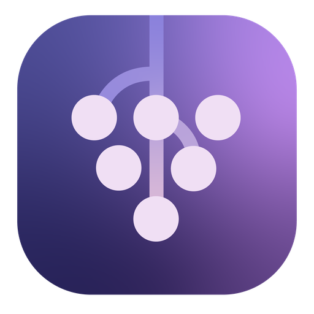
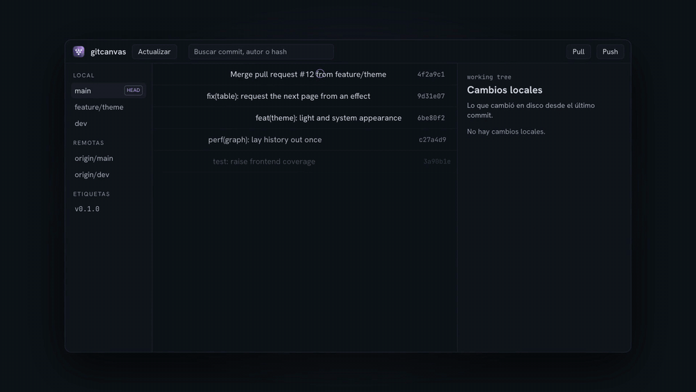
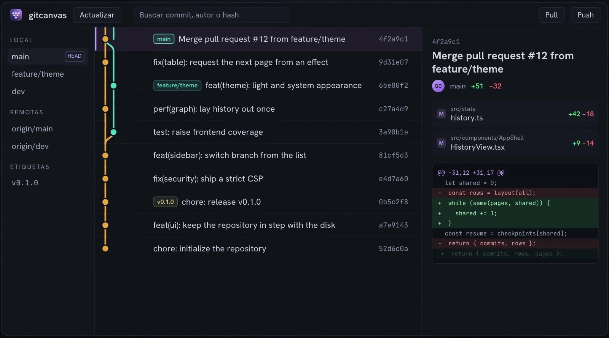

<p align="center">
  
</p>

<h1 align="center">GitCanvas</h1>

<p align="center">
  <strong>Git log is a list. Your history is a shape.</strong><br>
  A free, open-source visual Git client that draws your branches and merges so you can read a repository's history at a glance.
</p>

<p align="center">
  <a href="LICENSE"></a>
  
</p>

<p align="center">
  
</p>

GitCanvas does one thing: it lets you **see the shape of a repository's history**.
Open a local repository (or clone one from GitHub), scroll the branch graph, click any
commit and read what it changed. It updates as your working tree changes.

It is deliberately not a full Git client. If you want conflict resolution, interactive
rebase or pull-request workflows, tools like GitKraken, Tower or Fork do far more.
GitCanvas is the opposite trade: small, fast, free, and focused on reading history well.

<p align="center">
  
</p>

## Features

- **Branch graph with stable lanes.** Branches and merges are drawn as lanes in SVG, and
  lanes never reorder as you load more history. Branch and tag badges sit on the commits
  they point at.
- **Fast on large repositories.** History loads 500 commits at a time and the graph layout
  is extended page by page instead of recomputed, so a repository with a hundred thousand
  commits opens as quickly as one with fifty.
- **Commit inspector.** Author, full message, changed files (as a list or a directory
  tree) and a line-numbered diff against the first parent. Binary and oversized files are
  reported instead of rendered.
- **Live local changes.** Staged, unstaged and new files show up as a working-tree row and
  refresh as you edit, without reopening the repository.
- **Search.** Find a commit by message, author or abbreviated hash (`Cmd/Ctrl-F`).
- **GitHub clone.** Sign in with a personal access token, browse your repositories and
  clone one. The token is kept in your operating system's keychain and is only used inside
  the Rust core; it never reaches the interface.
- **Guarded actions.** Checkout refuses when it would lose uncommitted work. Pull is
  fast-forward only. Push always asks first and never forces.
- **Keyboard friendly**, with dark, light and system appearance.
- **No telemetry.** GitCanvas makes no analytics or tracking requests. Its only network
  access is Git itself (clone, fetch, pull, push) and, if you sign in, the GitHub API.

> The interface is currently in Spanish. Localization is not built yet.

## Install

Download the installer for your system from the
[latest release](https://github.com/dcardenasl/gitcanvas/releases/latest):

| System | Download |
|---|---|
| macOS (Apple Silicon and Intel) | `.dmg` |
| Windows | `.msi` or `-setup.exe` |
| Linux | `.AppImage`, `.deb` or `.rpm` |

GitCanvas is developed mostly on macOS. The release workflow also builds the Linux and
Windows installers, but those have seen much less hands-on use, so bug reports there are
especially welcome.

### First launch: the "unidentified developer" warning

The installers are **not code-signed yet**, so your operating system will warn you the
first time. That warning is about the missing signature, not about anything the app does;
the source is right here and you can build it yourself (see below).

- **macOS:** right-click the app, choose **Open**, then **Open** again. Or clear the
  quarantine flag once:

  ```bash
  xattr -dr com.apple.quarantine /Applications/GitCanvas.app
  ```

- **Windows (SmartScreen):** click **More info**, then **Run anyway**.
- **Linux (AppImage):** make it executable first: `chmod +x GitCanvas_*.AppImage`.

Code signing is planned; the release workflow is structured so it can be added without
restructuring anything.

## Use

Open a repository from the app with **Abrir repositorio**, or from a terminal the way a
Git client should behave:

```bash
# macOS
open -a GitCanvas --args /path/to/repo

# Linux / Windows, with the executable on your PATH
gitcanvas /path/to/repo
```

| Action | What happens |
|---|---|
| Scroll | Loads more history as you reach the end, 500 commits at a time |
| Click a commit | Opens the inspector with its author, message, files and diff |
| ↑ / ↓ | Moves the selection without leaving the keyboard |
| **Pull** | Fetches and fast-forwards. Anything needing a merge is reported, not resolved |
| **Push** | Asks for confirmation first, and never forces |
| **GitHub** | Stores a token in the OS keychain, lists your repositories, clones one |

Logs are written to `logs/` under the application data directory (daily JSONL, up to
seven files):

- macOS: `~/Library/Application Support/com.davidcardenas.gitcanvas/logs`
- Linux: `${XDG_DATA_HOME:-~/.local/share}/com.davidcardenas.gitcanvas/logs`
- Windows: `%APPDATA%\com.davidcardenas.gitcanvas\logs`

## Known limitations

Documented on purpose rather than discovered later:

- Diffs are computed **against the first parent only**. Combined diffs for merge commits
  are not supported yet.
- `pull` is **fast-forward only**. Anything that needs a merge is reported, not resolved
  automatically.
- Push is **never forced**.
- Cold topological reads of histories with many loose objects may exceed 300 ms;
  subsequent pages reuse a bounded SHA cache. Git reads run off the UI thread.
- Graph layout is optimised for the common case, not for histories with a very large
  number of simultaneously active branches.
- The installers are unsigned (see above) and the interface is in Spanish only.

## Build from source

Requirements:

- Node >= 22
- Rust stable (`rustup`), with the `clippy` and `rustfmt` components
- The platform toolchain for Tauri v2 (Xcode Command Line Tools on macOS; see the
  [Tauri prerequisites](https://v2.tauri.app/start/prerequisites/) for Linux and Windows)

```bash
npm install
npm run tauri build -- --bundles app   # macOS; omit --bundles to build every installer
```

On macOS the app is written to `target/release/bundle/macos/GitCanvas.app`.

## How it is built

| Layer | Choice |
|---|---|
| Shell | Tauri v2 |
| Git engine | Rust, `git2` (libgit2) with vendored libgit2 and OpenSSL |
| Type contracts | `tauri-specta` — Rust types generate `src/bindings.ts`, never hand-written |
| Graph layout | TypeScript, a pure function with no React, DOM or Tauri dependency |
| Render | SVG over row virtualization (`@tanstack/react-virtual`) |
| Frontend | React + TypeScript + Vite |

See [`ARCHITECTURE.md`](ARCHITECTURE.md) for the design, [`CHANGELOG.md`](CHANGELOG.md)
for what shipped, and [`TASKS.md`](TASKS.md) for how it was built.

## Development

```bash
npm install          # also installs the git hooks via the prepare script
npm run tauri dev    # run the app
npm run typecheck    # tsc --noEmit
npm run typecheck:e2e
npm run typecheck:node
npm run lint         # eslint
npm run format:check
npm run test:coverage
cargo fmt --all --check
cargo clippy --all-targets --all-features -- -D warnings
cargo test --workspace
npm run tauri build -- --ci
```

The end-to-end suite is `npm run test:e2e:run`; Linux CI runs it under Xvfb, while macOS
and Windows run with their native desktop environment. `npm run test:e2e` also builds the
app before starting the suite.

### Demo video tooling (maintainers only)

`tools/demo/` generates the narrated walkthrough videos used to promote the app
(`npm run record:demo`, `npm run record:demo:vertical`). It is intentionally excluded from
the application's CI, lint and TypeScript checks, and **you do not need it to contribute**.
It requires a sibling checkout of `bitacora-engine` at `../../bitacora-engine` (not part of
this repository), `ffmpeg`/`ffprobe`, ImageMagick, and the `edge-tts` command (or
`EDGE_TTS_COMMAND`); narration synthesis needs network access. Output goes to
`../../bitacora-engine/registry/projects/gitcanvas-output/` unless `GITCANVAS_VIDEO_DIR` is
set.

## Contributing

Bug reports, ideas and feedback are very welcome — please
[open an issue](https://github.com/dcardenasl/gitcanvas/issues). Pull requests are
considered case by case: open an issue first so we can agree on the change before you
spend time on it. GitCanvas is maintained by one person in spare time, so replies may take
a few days and there is no support SLA.

## Support the project

GitCanvas is free and nothing in the app is locked behind payment. Starring the repo,
reporting bugs and telling a colleague help just as much as anything else.

If it saves you time and you want to help keep it going, you can sponsor the project on
[GitHub Sponsors](https://github.com/sponsors/dcardenasl) — or use the Sponsor button at the top
of this repository. Entirely optional.

## License

[MIT](LICENSE) © 2026 David Cárdenas Lorca.
